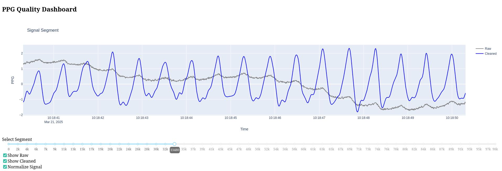
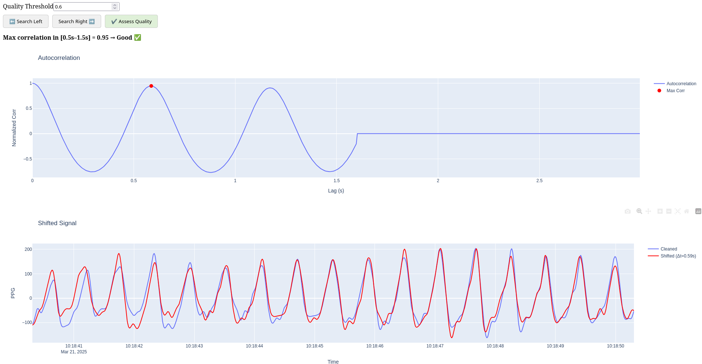

# Signal Quality Analyzer

[](https://www.python.org/downloads/)
[](LICENSE)

An interactive dashboard for analyzing and visualizing the quality of time series signals, with a focus on physiological data like PPG (photoplethysmography) and ECG (electrocardiography).


## Screenshots






## Features

- **Signal Segment Analysis**: Prepare and analyze segments of signal data with appropriate padding
- **Autocorrelation Quality Assessment**: Evaluate signal quality using cross-correlation with shifted segments
- **Interactive Dashboard**: Visual exploration of signal quality with real-time feedback
- **Quality-Based Navigation**: Search for high-quality signal segments using threshold criteria
- **Signal Normalization**: Optional normalization for better comparison

## How It Works

The tool assesses signal quality based on the periodicity of waveforms. For physiological signals like PPG and ECG, we expect a repetitive pattern corresponding to heart rate (typically 40-120 BPM or 0.5-1.5 seconds between peaks).

### Methodology:

1. **Segment Processing**: Signal is broken into segments of fixed duration
2. **Cleaning**: Signal is cleaned using specialized functions (e.g., `nk.ppg_clean()` for PPG data)
3. **Autocorrelation Analysis**: The cleaned signal is correlated with time-shifted versions of itself
4. **Quality Assessment**: Maximum correlation within the expected heart rate range determines quality
5. **Visual Feedback**: Interactive plots show raw vs. cleaned signals and correlation patterns

## Installation

```bash
pip install pandas numpy dash plotly
pip install neurokit2  # For PPG/ECG signal processing
```

## Usage

```python
from signal_quality_analyzer import analyze_signal_quality
import pandas as pd
import neurokit2 as nk

# Load your signal data
data = pd.read_csv("your_signal_data.csv")

# Optional: Define a normalization function
def zscore_normalize(signal):
    import numpy as np
    return (signal - np.mean(signal)) / np.std(signal)

# For PPG data
analyze_signal_quality(
    data,
    signal_col="ppg_signal",  # Column containing your signal data
    clean_func=nk.ppg_clean,  # PPG-specific cleaning function
    normalize_func=zscore_normalize,
    signal_label="PPG",
    sampling_rate=186  # Adjust to your data's sampling rate
)

# For ECG data
analyze_signal_quality(
    data,
    signal_col="ecg_signal",  # Column containing your ECG data
    clean_func=nk.ecg_clean,  # ECG-specific cleaning function
    signal_label="ECG",  
    sampling_rate=250  # Adjust to your data's sampling rate
)
```

## Dashboard Controls

- **Segment Slider**: Navigate through signal segments
- **Show Raw/Cleaned**: Toggle visibility of raw and cleaned signals
- **Normalize Signal**: Apply normalization to the displayed signals
- **Quality Threshold**: Set the correlation threshold for "good" signal quality
- **Search Left/Right**: Find segments meeting the quality threshold
- **Assess Quality**: Run quality analysis on the current segment

## Customization Options

The `analyze_signal_quality` function accepts the following parameters:

| Parameter | Description | Default |
|-----------|-------------|---------|
| `df` | DataFrame containing the signal | - |
| `signal_col` | Column name containing the signal | - |
| `clean_func` | Function to clean the signal | - |
| `signal_label` | Label for the signal | "Signal" |
| `normalize_func` | Optional function to normalize signals | None |
| `sampling_rate` | Sampling rate in Hz | 186 |
| `segment_duration_sec` | Duration of segment in seconds | 10 |
| `quality_lag_low` | Lower bound for quality assessment lag (seconds) | 0.5 |
| `quality_lag_high` | Upper bound for quality assessment lag (seconds) | 1.5 |
| `quality_threshold` | Threshold for good quality | 0.6 |
| `max_lag_sec` | Maximum lag in seconds for autocorrelation | 3 |
| `clean_padding_ratio` | Ratio of padding to add before cleaning | 0.2 |
| `delta_padding_sec` | Padding in seconds for delta calculation | 1.6 |
| `port` | Port for the Dash app | 32423 |
| `debug` | Run Dash app in debug mode | True |


## Example Output

The dashboard provides three main visualizations:

1. **Signal Plot**: Raw and cleaned signal segments
2. **Autocorrelation Plot**: Correlation at different time lags with peak identified
3. **Shifted Plot**: Comparison of original and time-shifted signals

## License

MIT License
